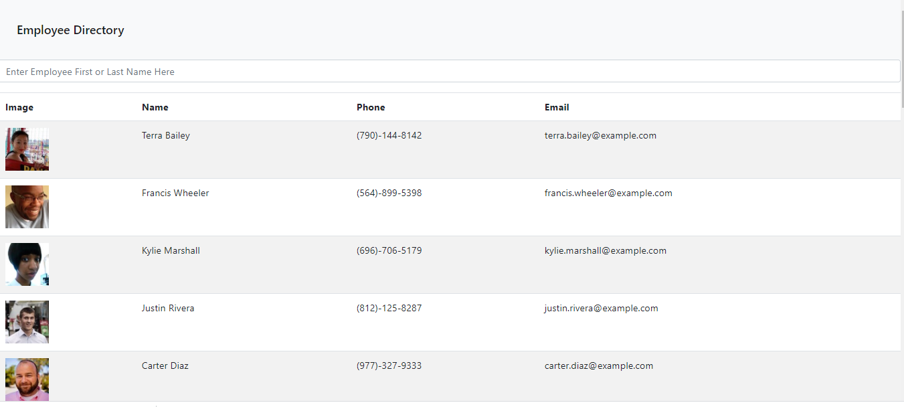
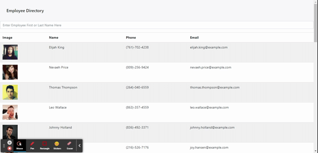

# directory-React
 This assignment will require you to break up your application's UI into components, manage component state, and respond to user events.

  * [Description](#description)
  * [Installation](#installation)

  
  ------------------------------------
  
  ## Description
  The requirements for this project were to create an employee directory with React.  When you load the page, it displays a directory.  

  

  After typing in either the first or last name, you are able to return the information for the employee you are looking for

  
  
  
  ------------------------------------
  
  ## Installation
  
  To install this application, you will need to enter the following line of code into a Node.js session.  
      
      npm install
  
  
  ------------------------------------